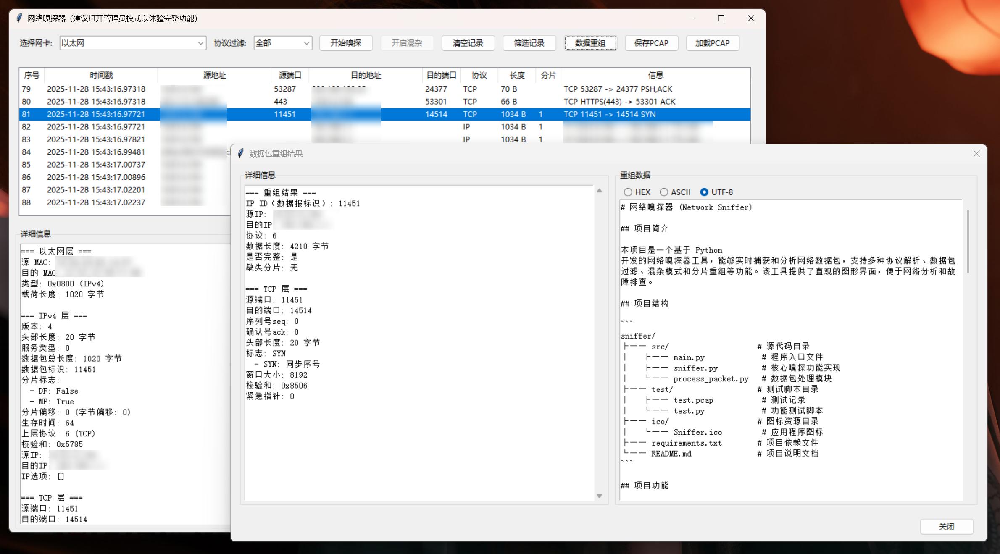
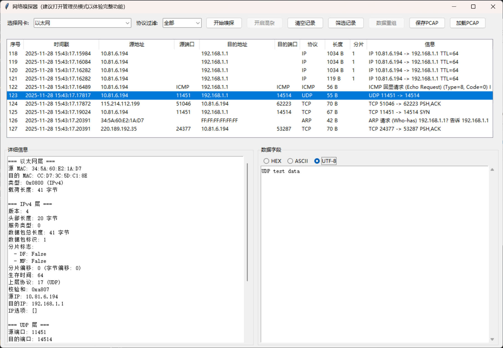

# 网络嗅探器 (Network Sniffer)

## 项目简介

本项目是一个基于 Python 开发的网络嗅探器工具，能够实时捕获和分析网络数据包，支持多种协议解析、数据包过滤、混杂模式和分片重组等功能。该工具提供了直观的图形界面，便于网络分析和故障排查。

## 项目结构

```
sniffer/
├── src/                    # 源代码目录
│   ├── main.py             # 程序入口文件
│   ├── sniffer.py          # 核心嗅探功能实现
│   └── process_packet.py   # 数据包处理模块
├── test/                   # 测试脚本目录
│   ├── test.py             # 功能测试脚本
│   └── hex2png.py          # 十六进制数据转换为PNG图片脚本
├── ico/                    # 图标资源目录
│   └── Sniffer.ico         # 应用程序图标
├── requirements.txt        # 项目依赖文件
└── README.md               # 项目说明文档
```

## 项目功能

1. **实时数据包捕获**：支持在不同网卡上实时捕获网络数据包
2. **多协议解析**：支持 TCP、UDP、ICMP、IPv4、IPv6、ARP 等常见网络协议的解析
3. **数据包过滤**：支持源/目标IP、源/目标端口等条件过滤数据包
4. **混杂模式支持**：可开启混杂模式捕获网络中所有数据包
5. **分片重组**：重组 IP 分片数据包，还原完整数据内容
6. **状态切换控制**：集成了开始/暂停功能按钮，方便控制捕获过程
7. **数据包统计**：提供数据包数量、流量统计等实时信息
8. **图形界面**：基于 Tkinter 构建的友好用户界面

## 项目使用方式

### 1. 环境要求

- Python 3.6 或更高版本
- 依赖库：
    - scapy >= 2.4.5
    - psutil >= 5.9.0
    - tkinter (Python标准库)

### 2. 安装依赖

```bash
pip install -r requirements.txt
```

### 3. 运行程序

```bash
python src/main.py
```

注意：在Windows系统上，需要以管理员权限运行程序才能以混杂模式捕获网络数据包。

### 4. 使用步骤

1. **选择网卡**：从下拉列表中选择要监听的网络接口
2. **设置过滤条件**（可选）：输入协议类型、IP地址或端口号进行过滤
3. **配置捕获选项**：开启/关闭混杂模式
4. **控制捕获过程**：
    - 点击控制按钮开始/暂停捕获
    - 点击清空按钮清除当前捕获的数据包
5. **筛选数据包**：根据IP地址、端口号等条件筛选捕获的数据包
6. **查看数据包详情**：
    - 在列表中选择数据包，在下方查看详细信息
    - 重组分片数据包，查看完整数据内容

## 项目打包方式

在根目录下使用 PyInstaller 将项目打包为单个可执行文件：

```bash
pyinstaller --onefile --windowed --name "MySniffer" --add-data "src\*.py;src" src\main.py --icon="./ico/Sniffer.ico"
```

### 打包参数说明

- `--onefile`：生成单个可执行文件
- `--windowed`：创建窗口应用，不显示命令行界面
- `--name "MySniffer"`：指定生成的可执行文件名称
- `--add-data "src\*.py;src"`：将 src 目录下的所有.py文件添加到可执行文件中
- `src\main.py`：指定程序入口文件
- `--icon="./ico/Sniffer.ico"`：指定应用程序图标

### 打包后文件

打包完成后，可执行文件将位于项目目录下的`dist`文件夹中：

```
/dist/MySniffer.exe
```

## 测试工具

项目提供了测试脚本`test/test.py`，用于验证嗅探器的功能：

1. **分片发送长报文**：测试嗅探器的分片重组功能
2. **发送图像文件**：测试文件内容传输的捕获
3. **多协议测试**：测试 TCP、UDP、ICMP、ARP 等协议的解析

在启动嗅探器后，运行测试脚本：

```bash
python test/test.py
```




在 `test/` 目录下，还提供了一个十六进制数据转换为 PNG 图片的脚本 `hex2png.py`，用于将测试脚本中发送的图片数据转换为 PNG 图片，方便查看和分析。

使用方法：将网络嗅探器中重组后的十六进制数据复制并保存到文件中，然后使用该脚本将其转换为PNG图片。

```bash
python test/hex2png.py --input [path/to/input] --output [path/to/output]
```

参数说明：

- `--input`：指定输入的十六进制数据文件路径
- `--output`：指定输出的 PNG 图片路径，默认值为 `output.png`

## 注意事项

1. **权限要求**：运行网络嗅探器需要管理员/root 权限
2. **网络安全**：在使用混杂模式时，请确保符合相关法律法规，仅用于合法的网络分析
3. **性能影响**：长时间捕获大量数据包可能会影响系统性能
4. **兼容性**：在不同操作系统上可能需要调整部分配置